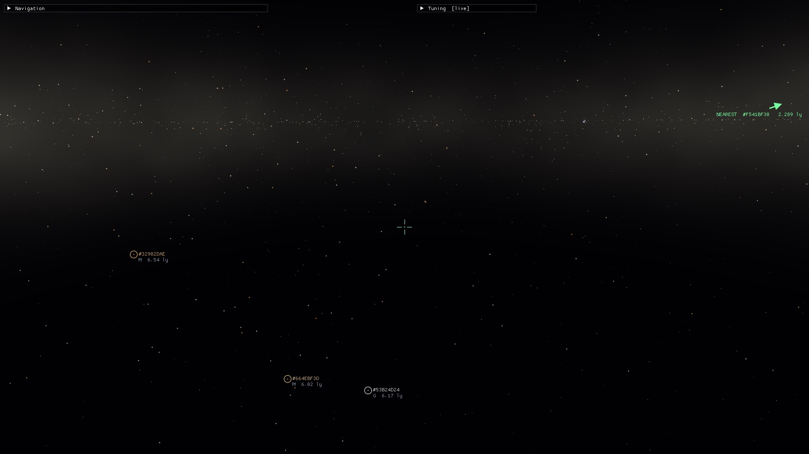
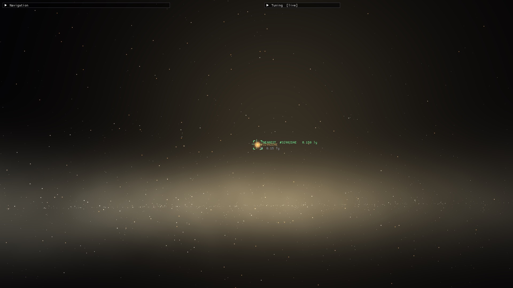
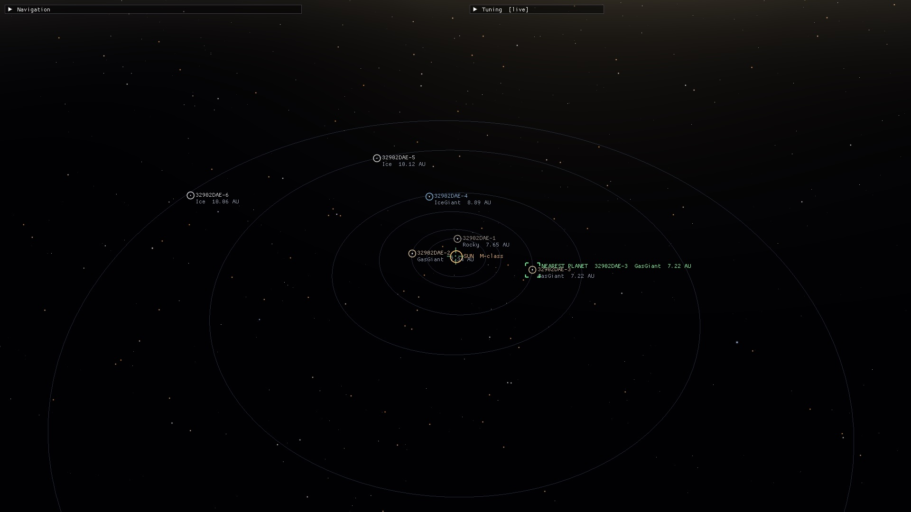
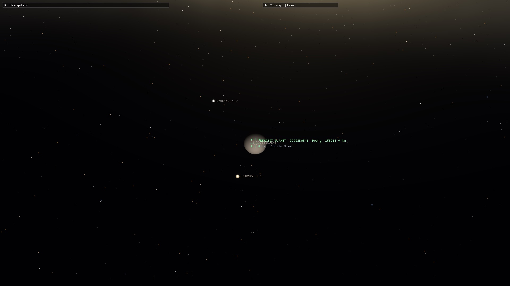
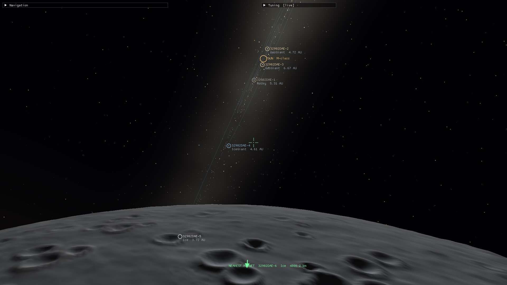
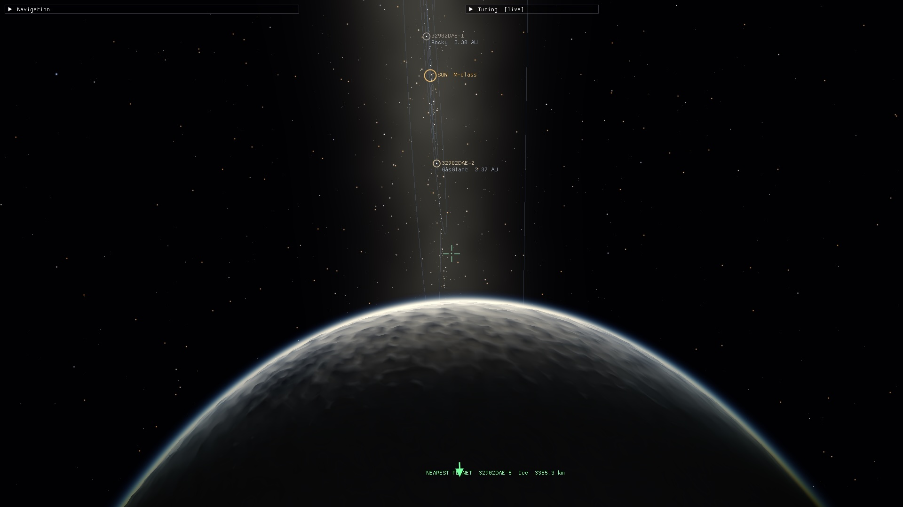
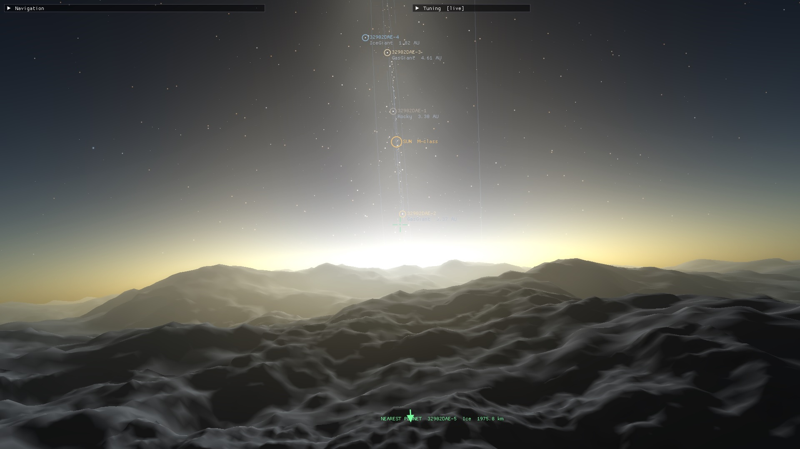
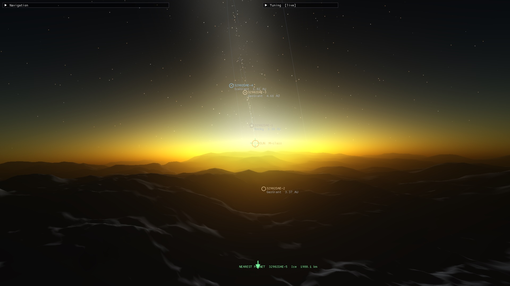

# DeepSpaceEngine

A C# / OpenGL space-exploration engine built for **true-scale distances** — billions of
procedurally-generated star systems, light-years apart, with seamless transitions from
interstellar flight down to standing on a planet. See the full design in
[`docs/PLAN.md`](docs/PLAN.md).

> **Status: Milestones M0–M4 complete.** Window + GL 4.1 context, the hierarchical
> coordinate system, a free-fly camera, a streaming procedural **star field**,
> **spawnable solar systems**, and now **landable planets**. Fly within 0.5 ly of a star
> and its deterministic system materialises (emissive sun, lit Keplerian-orbiting planets +
> moons, orbit rings). Approach a rocky planet and it switches to a **cube-sphere quadtree
> LOD terrain** generated from noise — descend all the way to the surface with no jitter
> (per-patch floating origin), and the camera rides the planet's orbital frame so it doesn't
> get left behind by time-lapse. The terrain layers **fBm continents**, **domain-warped
> ridged-multifractal mountains**, and **band-limited detail roughness** (octaves clamped to
> each LOD patch, so it's rugged up close yet alias-free from orbit). The LOD is **smooth**:
> detail **fades in continuously** (fractional octaves) and patches **geomorph** toward their
> parent between levels, so the surface no longer visibly rebuilds itself as you descend or skim.
> Together they give dramatic ranges and canyons, with **slope-aware colouring** (cliffs read as bare rock, snow only on gentle
> highlands) and per-type silhouettes. Ocean worlds get a **rugged sea floor under a translucent
> water surface** — coastlines, sandy beaches, depth-shaded shallows, and a sun glint, all from
> the land simply piercing a flat sea. Planets carry **real volumetric atmospheres** — a
> fullscreen pass ray-marches Rayleigh + Mie
> scattering, so the sky glows on the limb from space and turns blue overhead / hazy at the
> horizon / red toward the terminator on the surface. The atmosphere's **colour and thickness now
> derive from the scanned chemistry**: the scale height follows the mean molecular mass (heavy CO₂
> sits low and tight, light H₂ puffs up), Rayleigh strength tracks gas refractivity, absorbing gases
> tint the sky (methane → cyan), and haze gases + suspended surface dust add a Mie layer (iron-oxide
> red, silica tan, sulphurous yellow) — so a dusty high-CO₂ desert reads tan, a methane ice world
> cyan, and a clean N₂/O₂ world Earth-blue. A live **tuning HUD** exposes the
> atmosphere, relief, and biome knobs and saves them to `tuning.json`. Once you're low over a
> surface, press **R** to deploy a **drivable rover**: an arcade-grounded vehicle with real
> per-planet gravity that follows the terrain, tilts onto slopes, falls off ledges and lands,
> driven with throttle/steer under a third-person chase camera — press **R** again to lift back
> into free-fly. Deep space is no longer black — a **distant-galaxy backdrop** (a far-field star
> dome plus a glowing Milky-Way band with dust lanes and a central bulge) sits behind the streamed
> stars, and a **proximity speed limiter** keeps interstellar cruising unlimited yet smoothly reels
> your speed in as you near a star — and tighter still as you approach its planets and moons — so
> bodies no longer blur past in an instant (far from everything there's no limit at all). Terrain
> patches now **bake on a background worker pool**, with only the GPU upload left on the render
> thread, so descending toward a surface stays smooth instead of stalling the frame. The foreground
> star field is an **unbounded, distance-paged lattice of star blocks** — blocks generate around the
> camera and page out behind it, so the catalog scales to **billions of stars** with only a few
> million resident, each carrying a stable catalog number you can **search and jump straight to** (any
> block loads on demand). When a system is active the sun keeps a bright **glow** so the star still
> reads from across the system, and the **entire HUD toggles off with `H`** for a clean view.
> Generation is fully deterministic. M5 (fidelity) is underway.

## Screenshots

| | |
|---|---|
| <br>**Interstellar flight** — the distant Milky-Way band behind the streamed star field, with on-screen reticles (id · class · distance) and the green nearest-star arrow. | <br>**Closing on a star** — an M-class sun reticled at 0.15 ly against the glowing galactic bulge, just inside system-spawn range. |
| <br>**System overview** — a deterministic system materialised: emissive sun, Keplerian-orbiting planets and moons with `STAR-PLANET` designations and faint orbit rings. | <br>**Approach** — a rocky world with two moons, the moons marked by distance-scaled glow dots that fade as their spheres resolve. |
| <br>**Airless world** — a low pass over a cratered moon, the rest of the system strung across the sky above the limb. | <br>**Atmosphere from space** — the volumetric Rayleigh + Mie limb glow haloing a world as you drop toward it. |
| <br>**Sunrise on the surface** — ridged-multifractal mountains under aerial-perspective haze, the sun and sibling planets climbing the sky. | <br>**Sunset** — strong forward-scattered Mie glow reddening toward the terminator, with the planet chain overhead. |

## Tech stack

- **.NET 7** (targets `net7.0`; the plan calls for net8 LTS — a one-line change in
  `Directory.Build.props` once that SDK is installed)
- **Silk.NET 2.23.0** — OpenGL, windowing (GLFW), input, and `Vector3D<double>` math
- **OpenGL 4.1 core** — the cross-platform baseline that also runs on macOS (no compute
  shaders; procedural generation is CPU-side)
- **ImGui.NET** — debug HUD
- All NuGet versions are pinned exactly (no floating versions).

## Project layout

| Project | Responsibility |
|---------|----------------|
| `Engine.Core` | `UniversePosition` (hierarchical coords), deterministic hashing/RNG, math constants |
| `Engine.Rendering` | GL wrappers: `Shader`, `Mesh`, `Camera`, `Primitives`, matrix helpers |
| `Engine.Platform` | `GameWindow` — Silk.NET window + GL context + input bootstrap |
| `Game.Universe` | procedural generation: galaxy, the **tiled star lattice** — `StarCatalog` (one indexed block), `StarCatalogPager` (loads/evicts blocks around the camera, the `INearestStar` source) and `StarId` (packs the global, invertible catalog id); `StarField` is the legacy infinite cell-streamer; the `BackdropStars` far-field dome, `SystemGenerator` (planets + moons), `Noise` (fBm + ridged), `PlanetTerrain`, atmospheres, the `Rover` surface-physics sim, and the live knobs (`TerrainTuning`/`BiomeTuning` globals + `PlanetTuning` per-type overrides) |
| `Game.Systems` | runtime systems: `SolarSystemManager` (spawn/despawn lifecycle, sim time) and `SpeedPolicy` (the free-fly proximity speed limiter) |
| `Game.App` | entry point, main loop, `FreeFlyController` + `RoverController` (chase-cam driving), renderers (`StarRenderer`, `GalaxyBackdrop`, `SystemRenderer`, `PlanetTerrainRenderer` — patches baked on a background worker pool, uploaded on the render thread, `RoverRenderer`, depth-aware `AtmosphereRenderer` over a `SceneFramebuffer`), `StarOverlay`, HUD + tuning panel (`TuningConfig` save/load) |
| `Engine.Core.Tests` | xUnit tests: coordinate precision, generation determinism, terrain, rover, backdrop & speed policy |

## The core idea: precision at any distance

A single `double` resolves to only ~hundreds of km at galactic scale. `UniversePosition`
instead stores `Sector` (an `Int64` cube index per axis, sector = 1 AU) plus a `double`
`Local` offset within that sector. The fractional position always lives inside a small
sector, so the double's full precision yields **sub-millimetre resolution everywhere**, with
effectively unlimited range. Nothing absolute is ever sent to the GPU — `ToCameraRelative`
produces a small, precise float vector relative to the camera (floating origin).

## Build & run

```sh
dotnet build                       # build everything
dotnet test                        # run the coordinate/hashing test suite
dotnet run --project Game.App      # launch the engine
```

## Controls

| Input | Action |
|-------|--------|
| Mouse | Look — true 6-DOF, no pitch limit / no gimbal lock |
| `W` `A` `S` `D` | Move forward / left / back / right |
| `Q` / `E` | Roll left / right |
| Mouse wheel | Speed — sets a logarithmic *desired* speed (1 m/s → ~100 ly/s); the proximity limiter clamps it automatically near bodies |
| `,` / `.` | Orbit time-lapse slower / faster |
| `P` | Pause / resume orbital time |
| `F` | Toggle the body scanner panel |
| `R` | Drive the rover (when low over a surface) / return to free-fly |
| `H` | Toggle the entire HUD (reticles + all panels) on/off |
| `Tab` | Toggle mouse capture (to interact with the HUD) |
| `Esc` | Quit |

There is no dedicated up/down key — 6-DOF flight is achieved by pointing where you want with the
mouse (and rolling with `Q`/`E`) and thrusting forward.

**Rover (driving).** Fly within ~2 km of a solid surface and press `R` to drop a rover onto the
ground beneath you under a chase camera.

| Input | Action |
|-------|--------|
| `W` / `S` | Throttle forward / reverse |
| `A` / `D` | Steer left / right |
| `Space` | Brake |
| Mouse | Orbit the chase camera around the rover |
| `R` | Lift back into free-fly from where you parked |

The rover has real per-planet gravity, hugs the terrain and tilts onto slopes, and goes airborne
off ledges until it lands — it is arcade-grounded (per-wheel suspension comes in M5). It samples the
height at the **same LOD the renderer draws**, so it rests exactly on the visible surface (no sinking
into / floating above the mesh), and **sticks to the ground** over crests and dips instead of
launching off every bump.

**Proximity speed.** The wheel always sets a single *desired* speed — logarithmic, from 1 m/s up to
~100 ly/s. Your actual speed is that value clamped by a **proximity limiter** that depends only on how
close you are to a body: far from everything there is **no limit** (cruise the galaxy at full speed),
but as you approach a star your top speed is smoothly reeled in, and tighter still as you near its
planets and moons — so you decelerate into an approach instead of blasting past. The slowdown is
*self-converging*: the cap is proportional to your distance from the nearest surface, so each second
covers a fraction of the remaining distance rather than overshooting, and it rises continuously back
to "unlimited" at the edge of a body's zone (no speed cliff). A per-frame anti-tunnelling clamp means
even at extreme speed (or a low frame-rate) you can never skip straight through a body. To ease below
the automatic limit for a fine descent, just wheel the desired speed down; the HUD shows the current
speed and flags when the limiter is holding you below what the wheel commands.

**Navigation aids.** In open space, nearby stars carry reticles (catalog number + class +
distance) and a green arrow always points to the nearest star. Inside a system the star
clutter drops away: the sun is marked, each planet shows its `STAR-PLANET` designation, and
a planet's moons (`STAR-PLANET-MOON`) only reveal once you fly close to it. A "nearest
planet" arrow guides you in. Catalog numbers are plain decimal indices into the star catalog
(star `42`, planet `42-1`, moon `42-1-3`).

**Find a star.** The HUD's *Find star* box takes a catalog number — type it and press *Find* to flag
that star with an amber target marker (on-screen brackets, or an edge arrow when it's off-screen or
behind you), then *Go to it* to jump the camera in to frame it within system-spawn range. Every star
in the lattice is addressable: the id encodes its block, so finding one **loads that block on demand**
even if it's nowhere near you. Stars in the home block keep the small numbers `0 … N-1`.

**Scanner.** Press `F` to toggle a scanner panel that reads out the nearest body once you're in
range — class, radius, surface gravity, temperature, hydrosphere, surface pressure, and
atmosphere/surface composition (works for planets and moons alike), with habitable worlds flagged.
The composition is the **same data that drives the atmosphere's appearance**, so the sky you see
matches the gases (and pressure) the scanner reports.

**HUD.** Shows sector/local position, distance from origin (ly), speed, FPS, the active
system (planets, moons, orbit time-lapse with apparent speed in `c`), and — when landing —
your altitude and live terrain patch counts. Fly to extreme distances to confirm there is
**no positional jitter**.

**Tuning panel.** A second HUD window with live controls for the **star field** (catalog
brightness, perceptual falloff/gamma, and point size), the **galaxy backdrop** (an on/off
toggle plus band-glow and distant-star brightness), the **atmosphere** (an on/off
toggle, plus sun intensity, exposure, Rayleigh/Mie strength, haze anisotropy, shell height —
and a *Debug: transmittance* toggle that shows the ray-march geometry), **terrain relief**
(relief scale, mountain bias, feature frequency), **surface detail** (LOD distance — how aggressively
the terrain subdivides on approach — plus detail-normal strength/fineness/range and material breakup),
and **biome/colour** (snow line, cliff threshold and strength, lowland tint, rock/snow/cliff colours).
Atmosphere updates instantly;
terrain/biome changes regenerate the meshes live. Turning the atmosphere off renders the bare
surface — handy for inspecting terrain.

The terrain/biome controls edit either the **global defaults** or a **per-planet-type override**:
pick a type (it auto-follows the world you fly down to), tick *Override for &lt;type&gt;*, and that
type carries its own palette/relief — e.g. jagged red lava worlds vs. smooth pale ice worlds —
while every type without an override keeps the global look.

**Save settings** writes everything (globals + enabled overrides) to `tuning.json` (next to
`imgui.ini`), which auto-loads on the next launch — so a look you dial in becomes the new default.
Defaults are neutral, so generation stays deterministic until you turn a knob.

## Roadmap

- **M0 — Foundation** ✅ window, coords + tests, free-fly camera, debug scene
- **M1 — Star field & true scale** ✅ procedural galaxy, point-sprite star rendering, cell streaming, nearest-star HUD, on-screen reticles + nearest-star navigation arrow
- **M2 — Solar systems** ✅ deterministic system generation, spawn/despawn at 0.5 ly (hysteresis), emissive sun + lit orbiting planets + orbit rings
- **M3 — Planets & terrain** ✅ cube-sphere quadtree-LOD terrain with **ridged-multifractal mountains** + domain warp + **per-LOD band-limited detail** + **slope-aware biome colouring**, skirts, per-patch floating origin, frame-riding, descend & land with no jitter; **ocean worlds** (rugged sea floor + translucent water surface + coastlines); **moons**; **volumetric (Rayleigh + Mie) atmospheres**; **live tuning HUD** with `tuning.json` save/load
- **M4 — Rover** ✅ drivable surface vehicle: per-planet gravity, terrain-following + slope tilt, ledge falls/landings, throttle/steer driving under a third-person chase camera (`R` to deploy/exit); arcade-grounded, pure testable sim
- **M5 — Fidelity** (in progress) — **distant-galaxy backdrop** ✅ (a deterministic far-field dome of background stars concentrated on the galactic plane + a fullscreen Milky-Way band with dust lanes and a central bulge, drawn behind the streamed star field, with live brightness knobs saved to `tuning.json`); **smooth terrain LOD** ✅ (continuous fractional-octave detail fade + geomorphing between levels + merge hysteresis, so the surface no longer pops/rebuilds across LOD transitions); **planetary rings** ✅ (gas/ice giants get a deterministic banded annulus in their tilted equatorial plane — procedural radial bands with Cassini-like gaps, sunlit and translucent, with the planet casting a real shadow across the ring); **threaded terrain generation** ✅ (patch meshes baked on a background worker pool, uploaded on the render thread, so descending to a surface no longer stalls the frame); **proximity speed limiter** ✅ (continuous distance-based slowdown near stars, planets and moons — unlimited in open space, with anti-tunnelling so you can't skip through a body); **tiled star catalog** ✅ (the foreground field is a **distance-paged lattice** of spatially-indexed star blocks — billions of stars addressable, only a few million resident, blocks generated/evicted around the camera; each star keeps a stable, invertible catalog id, so search-by-number and jump-to-star load any block on demand, and per-block re-centring removes the floating-point jitter the single block had far from the origin); **rover terrain-follow** ✅ (samples the drawn-mesh LOD so it rests on the visible surface, with ground-stick over crests/dips); **sun glow** ✅ (the active system's star stays a bright point from across the system); **HUD toggle** ✅ (`H` hides all on-screen UI); **composition-driven atmospheres** ✅ (colour + thickness derived from the scanned chemistry — scale height from mean molar mass, Rayleigh strength from gas refractivity, absorption tint from coloured gases like methane, and a Mie haze layer from haze gases + suspended surface dust, with surface pressure modelled and shown in the scanner); still to come: per-wheel suspension, planet rotation, erosion & more biomes, animated water
