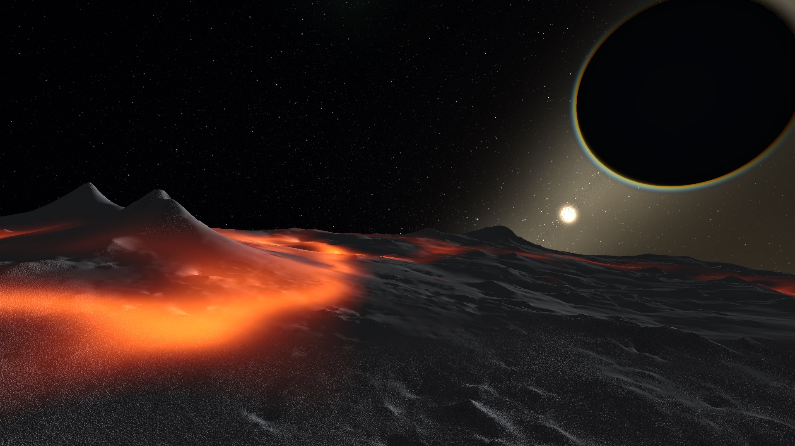
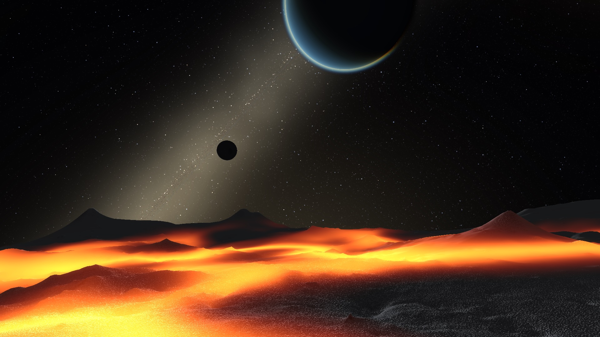

# DeepSpaceEngine

A C# / OpenGL space-exploration engine built for **true-scale distances** — billions of
procedurally-generated star systems, light-years apart, with seamless transitions from
interstellar flight down to standing on a planet. See the full design in
[`docs/PLAN.md`](docs/PLAN.md).

> **Status: Milestones M0–M4 complete; M5 (fidelity) + M6 (a hierarchical universe of galaxies) in.** Window + GL 4.1 context, the hierarchical
> coordinate system, a free-fly camera, a streaming procedural **star field**,
> **spawnable solar systems**, and now **landable planets**. Fly within 0.5 ly of a star
> and its deterministic system materialises (emissive sun, lit Keplerian-orbiting planets +
> moons, orbit rings). Approach a rocky planet and it switches to a **cube-sphere quadtree
> LOD terrain** generated from noise — descend all the way to the surface with no jitter
> (per-patch floating origin), and the camera rides the planet's orbital frame so it doesn't
> get left behind by time-lapse. The terrain layers **fBm continents**, **domain-warped
> ridged-multifractal mountains**, and **band-limited detail roughness** (octaves clamped to
> each LOD patch, so it's rugged up close yet alias-free from orbit). The LOD is **smooth**:
> detail **fades in continuously** (fractional octaves) and patches **geomorph** toward their
> parent between levels, so the surface no longer visibly rebuilds itself as you descend or skim.
> Together they give dramatic ranges and canyons, with **slope-aware colouring** (cliffs read as bare rock, snow only on gentle
> highlands) and per-type silhouettes. Ocean worlds get a **rugged sea floor under a translucent
> water surface** — coastlines, sandy beaches, depth-shaded shallows, and a sun glint, all from
> the land simply piercing a flat sea. Terrain is now **generated on the GPU by default** — a
> fragment pass bakes each quadtree patch into a height/normal/albedo **texture tile** and the
> vertex shader displaces the base sphere via vertex texture fetch (the CPU worker-pool bake stays
> a one-click fallback) — which adds **impact craters with dark maria** on airless worlds, **eroded
> valley detail** (slope-damped, so valley floors carve smooth while roughness rides the ridges), and
> a per-pixel **orbital macro-relief** that shades the *same* mountain and crater field the tiles bake:
> the ranges and craters you see from space are the ones you land on, and they fade out seamlessly as
> the real geometry resolves on descent. Planets carry **real volumetric atmospheres** — a
> fullscreen pass ray-marches Rayleigh + Mie
> scattering, so the sky glows on the limb from space and turns blue overhead / hazy at the
> horizon / red toward the terminator on the surface. The atmosphere's **colour and thickness now
> derive from the scanned chemistry**: the scale height follows the mean molecular mass (heavy CO₂
> sits low and tight, light H₂ puffs up), Rayleigh strength tracks gas refractivity, absorbing gases
> tint the sky (methane → cyan), and haze gases + suspended surface dust add a Mie layer (iron-oxide
> red, silica tan, sulphurous yellow) — so a dusty high-CO₂ desert reads tan, a methane ice world
> cyan, and a clean N₂/O₂ world Earth-blue. A live **tuning HUD** exposes the
> atmosphere, relief, and biome knobs and saves them to `tuning.json`. Once you're low over a
> surface, press **R** to deploy a **drivable rover**: an arcade-grounded vehicle with real
> per-planet gravity that follows the terrain, tilts onto slopes, falls off ledges and lands — riding a
> **damped per-wheel suspension** that rests on a collision mesh of the drawn surface and lets each
> wheel travel independently — driven with throttle/steer under a third-person chase camera; press **R**
> again to lift back into free-fly. Deep space is no longer black — a **distant-galaxy backdrop** (a far-field star
> dome plus a glowing Milky-Way band with dust lanes and a central bulge) sits behind the streamed
> stars, and **procedurally-placed fly-to nebulae** — a handful of enormous, soft, emissive gas
> clouds scattered through the disk — read as colourful glowing landmarks you can spot from across
> the galaxy, pick out on the galaxy map, and drift right through (the billboard fades as you enter,
> so you pass into a haze of coloured light and embedded stars rather than hitting a flat sheet);
> their count and size are live-tunable and saved to `tuning.json`. A **proximity speed limiter** keeps interstellar cruising unlimited yet smoothly reels
> your speed in well before you reach a star — gently, on a dedicated star approach rate, so you ease in
> instead of zipping past — and tighter still as you approach its planets and moons (far from everything
> there's no limit at all). Terrain
> patches now **bake on a background worker pool**, with only the GPU upload left on the render
> thread, so descending toward a surface stays smooth instead of stalling the frame. The foreground
> star field is an **unbounded, distance-paged lattice of star blocks** — blocks generate around the
> camera and page out behind it, so the catalog scales to **billions of stars** with only a few
> million resident, each carrying a stable catalog number you can **search and jump straight to** (any
> block loads on demand). When a system is active the sun keeps a bright **glow** so the star still
> reads from across the system, and the **entire HUD toggles off with `H`** for a clean view.
> Inhabited worlds now glow with **clustered city lights** on their night side, and **gas and ice giants
> wear banded cloud zones** with a storm oval. The GPU terrain reached **full CPU parity** with
> **micro-relief and strata** (mesas, banded canyon walls). Up close, a **multi-spawner surface-object
> scatter** plants objects on the drawn terrain — each samples the *same* height tile the mesh uses, so it
> sits exactly on the surface no matter how extreme the world's relief. Each spawner is its own layer
> (rocks, trees, pickups…) with its own mesh, density, size and orientation (world-up / surface-normal /
> random), decorrelated so layers don't stack, and gated per world by **environment traits** (so
> vegetation skips airless moons), a **spawn-chance** dice-roll, and an optional **altitude band** (a
> min/max height above the base radius, so a layer can stay out of the oceans and off the high peaks):
> the foundation for trees, grass and
> pickups. The universe is now a **hierarchy of galaxies**: you start inside the Milky Way, and if
> you fly out you see other galaxies — at first as bright points, resolving on approach into oriented
> **spiral/elliptical disks** (a glowing bulge + dark dust lanes), then into a **volumetric star
> cloud** with parallax, and finally into real streamed stars as you cross in. Stars only exist inside
> galaxies (intergalactic space is genuinely empty), each galaxy carries its own **central black hole**
> and its own **nebulae**, and the top speed reaches **~100 Mly/s** so the voids are crossable (with a
> *travel-to-galaxy* list in the HUD). A galaxy's halo is dotted with **globular clusters** — fuzzy
> stars from thousands of ly out that resolve into a dense knot of **real, visitable stars**, each with
> its own solar system. Generation is fully deterministic. M5 (fidelity) is underway.

## Screenshots

| | |
|---|---|
| <br>**Interstellar flight** — the distant Milky-Way band behind the streamed star field, with on-screen reticles (id · class · distance) and the green nearest-star arrow. | <br>**Closing on a star** — an M-class sun reticled at 0.15 ly against the glowing galactic bulge, just inside system-spawn range. |
| <br>**System overview** — a deterministic system materialised: emissive sun, Keplerian-orbiting planets and moons with `STAR-PLANET` designations and faint orbit rings. | <br>**Approach** — a rocky world with two moons, the moons marked by distance-scaled glow dots that fade as their spheres resolve. |
| <br>**Airless world** — a low pass over a cratered moon, the rest of the system strung across the sky above the limb. | <br>**Atmosphere from space** — the volumetric Rayleigh + Mie limb glow haloing a world as you drop toward it. |
| <br>**Sunrise on the surface** — ridged-multifractal mountains under aerial-perspective haze, the sun and sibling planets climbing the sky. | <br>**Sunset** — strong forward-scattered Mie glow reddening toward the terminator, with the planet chain overhead. |
| <br>**Volcanic world** — glowing molten lava pooled around the base of 3-D volcano cones on the dark basalt crust, lit by the system's sun low on the limb with a sibling planet beyond. | <br>**Rivers of lava** — bright molten lava threading the cooled crust, glowing on the night side and blooming, beneath a sibling world's atmospheric crescent, a dark moon, and the Milky-Way band. |

## Tech stack

- **.NET 7** (targets `net7.0`; the plan calls for net8 LTS — a one-line change in
  `Directory.Build.props` once that SDK is installed)
- **Silk.NET 2.23.0** — OpenGL, windowing (GLFW), input, and `Vector3D<double>` math
- **OpenGL 4.1 core** — the cross-platform baseline that also runs on macOS (no compute
  shaders; terrain is generated GPU-side by default via fragment-shader passes baked into texture
  tiles — no compute required — with the CPU worker-pool bake as a fallback)
- **OpenAL** (Silk.NET.OpenAL + OpenAL Soft, native binaries bundled for macOS/Windows/Linux) — sound
  effects and streaming music; degrades to silent when no audio device is present
- **ImGui.NET** — debug HUD
- **REST discovery backend** (optional) — `HttpClient` + `System.Text.Json` client talking to a
  standalone **PHP + MySQL** service; off by default, degrades to offline when unreachable
- All NuGet versions are pinned exactly (no floating versions).

## Project layout

| Project | Responsibility |
|---------|----------------|
| `Engine.Core` | `UniversePosition` (hierarchical coords), deterministic hashing/RNG, math constants |
| `Engine.Rendering` | GL wrappers: `Shader`, `Mesh`, `Camera`, `Primitives`, matrix helpers |
| `Engine.Platform` | `GameWindow` — Silk.NET window + GL context + input bootstrap |
| `Engine.Audio` | `AudioEngine` — OpenAL device/context, a pooled one-shot SFX player, a gapless looping music streamer, master/music/sfx volume buses, and a `WavLoader` + procedural `Synth` fallback |
| `Game.Universe` | procedural generation. **Universe of galaxies** — `Galaxy` + `GalaxyCatalog`/`GalaxyCatalogPager` (a sparse lattice of galaxies, the `INearestGalaxy` source), `GalaxyField` (cosmic density), `GalaxyModel` (one galaxy's stellar density: disk/arms/bulge), `GalaxyId`, and `GalaxyCloud` (a galaxy's volumetric point set). **Tiled star lattice** confined to galaxy interiors — `StarCatalog` (one indexed block; injects globular-cluster stars), `StarCatalogPager` (loads/evicts blocks around the camera, the `INearestStar` source) and `StarId` (packs the global, invertible catalog id). **Globular clusters** — `GlobularCluster`/`GlobularClusters` (halo clusters + their shared per-star generator). Plus `BackdropStars`, `NebulaField` (per-galaxy), `SystemGenerator` (planets + moons), `Noise` (fBm + ridged), `PlanetTerrain`, atmospheres, the `Rover` surface-physics sim, the live knobs (`TerrainTuning`/`BiomeTuning` globals + `PlanetTuning` per-type overrides), and the legacy `StarField` cell-streamer |
| `Game.Systems` | runtime systems: `SolarSystemManager` (spawn/despawn lifecycle, sim time), `SpeedPolicy` (the free-fly proximity speed limiter), and `Discovery/` (the networked discovery client — `ObjectId` id scheme, async `DiscoveryClient`, thread-safe `DiscoveryService`) |
| `Game.App` | entry point, main loop, `FreeFlyController` + `RoverController` (chase-cam driving), renderers (`StarRenderer`, `GalaxyRenderer` (the point→impostor→cloud galaxy LOD), `GlobularClusterRenderer` (fuzzy sprite→resolved star cloud), `GalaxyBackdrop`, `SystemRenderer`, `PlanetTerrainRenderer` — either GPU-generated tiles (`TerrainTileGenerator` + `TerrainTileCache`, the default) or CPU patches baked on a background worker pool and uploaded on the render thread, `RoverRenderer`, depth-aware `AtmosphereRenderer` over a `SceneFramebuffer`), `StarOverlay`, HUD + tuning panel (`TuningConfig` save/load) |
| `Engine.Core.Tests` | xUnit tests: coordinate precision, generation determinism, terrain, rover, backdrop & speed policy |
| `server/` | standalone **PHP + MySQL** discovery API + server-rendered HTML log (not part of the .NET solution) |

## The core idea: precision at any distance

A single `double` resolves to only ~hundreds of km at galactic scale. `UniversePosition`
instead stores `Sector` (an `Int64` cube index per axis, sector = 1 AU) plus a `double`
`Local` offset within that sector. The fractional position always lives inside a small
sector, so the double's full precision yields **sub-millimetre resolution everywhere**, with
effectively unlimited range. Nothing absolute is ever sent to the GPU — `ToCameraRelative`
produces a small, precise float vector relative to the camera (floating origin). The range is vast
enough that the **entire observable universe fits** (galaxies millions of light-years apart) at the
same sub-mm precision — which is what lets the galaxy hierarchy share one coordinate space.

## Build & run

**Prerequisites — the [.NET 7 SDK](https://dotnet.microsoft.com/download/dotnet/7.0).** If you downloaded
this repo as a ZIP and `dotnet build` / `dotnet run` does nothing — or you see `dotnet: command not found` —
you just need the SDK. Download it free from Microsoft's official page and pick the **SDK** installer for your
platform:

- **[.NET 7.0 downloads (all platforms)](https://dotnet.microsoft.com/download/dotnet/7.0)** — e.g. macOS
  Arm64 (`.pkg`), Windows x64 (`.exe`), or Linux.

Confirm it's installed with `dotnet --version` (should print `7.x`), then:

```sh
dotnet build                       # build everything
dotnet test                        # run the coordinate/hashing test suite
dotnet run --project Game.App      # launch the engine
```

## Controls

| Input | Action |
|-------|--------|
| Mouse | Look — true 6-DOF, no pitch limit / no gimbal lock |
| `W` `A` `S` `D` | Move forward / left / back / right |
| `Q` / `E` | Roll left / right |
| Mouse wheel | Speed — sets a logarithmic *desired* speed (1 m/s → ~100 Mly/s, for crossing intergalactic voids); the proximity limiter clamps it automatically near bodies |
| `,` / `.` | Orbit time-lapse slower / faster |
| `P` | Pause / resume orbital time |
| `F` | Toggle the body scanner panel |
| `M` | Toggle the system map (top-down schematic of the active system) |
| `N` | Toggle the galaxy map (2D chart of nearby stars; "Open 3D view" for a navigable 3-D neighbourhood) |
| `R` | Drive the rover (when low over a surface) / return to free-fly |
| `H` | Toggle the entire HUD (reticles + all panels) on/off |
| `Tab` | Toggle mouse capture (to interact with the HUD) |
| `Esc` | Quit |

There is no dedicated up/down key — 6-DOF flight is achieved by pointing where you want with the
mouse (and rolling with `Q`/`E`) and thrusting forward.

**Rover (driving).** Fly within ~2 km of a solid surface and press `R` to drop a rover onto the
ground beneath you under a chase camera.

| Input | Action |
|-------|--------|
| `W` / `S` | Throttle forward / reverse |
| `A` / `D` | Steer left / right |
| `Space` | Brake |
| Mouse | Orbit the chase camera around the rover |
| `R` | Lift back into free-fly from where you parked |

The rover has real per-planet gravity, hugs the terrain and tilts onto slopes, and goes airborne
off ledges until it lands. It rests on a **collision mesh of the actual drawn triangles** (each leaf
patch keeps its CPU-side vertex heights and the geomorph it was drawn with), so it sits exactly on the
visible surface — no sinking into / floating above the mesh, and no LOD-feedback bounce — and **sticks
to the ground** over crests and dips. On top of that it rides a **damped per-wheel suspension**: each
wheel travels independently in its well while the chassis bobs and rocks, settling springily without
ever bouncing back off the ground.

**Proximity speed.** The wheel always sets a single *desired* speed — logarithmic, from 1 m/s up to
~100 Mly/s (galaxies are millions of ly apart, so the void needs real warp). Your actual speed is that value clamped by a **proximity limiter** that depends only on how
close you are to a body: far from everything there is **no limit** (cruise the galaxy at full speed),
but as you approach a star your top speed is smoothly reeled in, and tighter still as you near its
planets and moons — so you decelerate into an approach instead of blasting past. The slowdown is
*self-converging*: the cap is proportional to your distance from the nearest surface, so each second
covers a fraction of the remaining distance rather than overshooting, and it rises continuously back
to "unlimited" at the edge of a body's zone (no speed cliff). A per-frame anti-tunnelling clamp means
even at extreme speed (or a low frame-rate) you can never skip straight through a body. To ease below
the automatic limit for a fine descent, just wheel the desired speed down; the HUD shows the current
speed and flags when the limiter is holding you below what the wheel commands.

**Navigation aids.** In open space, nearby stars carry reticles (catalog number + class +
distance) and a green arrow always points to the nearest star. Inside a system the star
clutter drops away: the sun is marked, each planet shows its `STAR-PLANET` designation, and
a planet's moons (`STAR-PLANET-MOON`) only reveal once you fly close to it. A "nearest
planet" arrow guides you in. Catalog numbers are plain decimal indices into the star catalog
(star `42`, planet `42-1`, moon `42-1-3`).

**Find a star.** The HUD's *Find star* box takes a catalog number — type it and press *Find* to flag
that star with an amber target marker (on-screen brackets, or an edge arrow when it's off-screen or
behind you), then *Go to it* to jump the camera in to frame it within system-spawn range. Every star
in the lattice is addressable: the id encodes its block, so finding one **loads that block on demand**
even if it's nowhere near you. Stars in the home block keep the small numbers `0 … N-1`.

**Galaxies & clusters.** Fly out of the Milky Way and the other galaxies appear — a faint point far off
that **swells into a bright star** as you approach, then resolves into a tilted **spiral or elliptical
disk** (glowing bulge + dark dust lanes), then a **3-D star cloud** you can fly into, and finally the
galaxy's real streamed stars as you cross inside. Each galaxy has its own central black hole, its own
nebulae, and a halo of **globular clusters**: from thousands of ly away each reads as a fuzzy star
(tagged on the HUD with a `GC` bracket reticle + distance), and as you close in it resolves into a dense
ball of **real stars you can visit** — every one spawns its own solar system, just like the disk stars.
The Navigation panel lists the nearest galaxies with a **Go** button (a few radii out, framed) so the
millions-of-ly voids are actually crossable; intergalactic space itself is empty (stars exist only
inside galaxies). The galaxy look (point/impostor/cloud brightness and sizes, cloud point size, and the
globular sprite/star brightness) is live-tunable in the Tuning panel and saved to `tuning.json`.

**Maps.** Press `M` for the **system map** — a top-down schematic of the active system with the sun at
centre, planets on log-radial orbit rings at their live angle, moons, the asteroid belt, and a "you are
here" marker; click a planet or moon to read its scan data and *Travel here*. Press `N` for the **galaxy
map** — a pannable, zoomable top-down chart of the nearby catalog stars projected onto the galactic plane,
coloured by star colour and sized by luminosity, with markers for you, the active system and the search
target, and the **fly-to nebulae** drawn as translucent coloured disks (hover for the name) so you can
aim for one; click a star to *Jump here* or set it as the navigation search target. From the galaxy map,
**Open 3D view** for a navigable 3-D view of your stellar neighbourhood: an orbit camera (drag to rotate,
wheel to zoom) over every star within an adjustable radius (10–50 ly), threaded by a single nearest-neighbour
route from your position; click a star to recentre on it and set it as the fly-to target (an arrow then
points to it back in fly view). (The galaxy maps currently show the resident star bubble; streaming new
stars in as you roam past it is a follow-up.)

**Scanner.** Press `F` to toggle a scanner panel that reads out the nearest body once you're in
range — class, radius, surface gravity, temperature, hydrosphere, surface pressure, and
atmosphere/surface composition (works for planets and moons alike), with habitable worlds flagged.
The composition is the **same data that drives the atmosphere's appearance**, so the sky you see
matches the gases (and pressure) the scanner reports. When **no body is in scan range** the panel
widens out: inside a system it reports the **star and its system** (spectral class, temperature,
luminosity, mass, radius, and the planet roster); out in interstellar space it reports the **sector**
(galactic position, resident star count, and the nearest catalog star — the one whose system would
spawn).

**HUD.** Shows sector/local position, distance from origin (ly), speed, FPS, the active
system (planets, moons, orbit time-lapse with apparent speed in `c`), and — when landing —
your altitude and live terrain patch counts. Fly to extreme distances to confirm there is
**no positional jitter**.

**Tuning panel.** A second HUD window with live controls for the **star field** (catalog
brightness, perceptual falloff/gamma, and point size), the **galaxies (LOD)** (point brightness/size,
impostor and cloud brightness, cloud point size — fewer/larger for performance), the **globular
clusters** (sprite and resolved-star brightness, star size), the **galaxy backdrop** (an on/off
toggle plus band-glow and distant-star brightness), the **fly-to nebulae** (an on/off toggle, glow
intensity, and the generation knobs — how many and their min/max radius in light-years, which
regenerate the field on release), the **atmosphere** (an on/off
toggle, plus sun intensity, exposure, Rayleigh/Mie strength, haze anisotropy, shell height —
and a *Debug: transmittance* toggle that shows the ray-march geometry), **terrain relief**
(relief scale, mountain bias, feature frequency), **surface detail** (LOD distance — how aggressively
the terrain subdivides on approach — plus detail-normal strength/fineness/range and material breakup),
**surface objects** (the up-close scatter — a live add/remove list of spawner layers, each with its own
mesh, density, size range, orientation, required environment traits, per-world spawn chance and an
optional **altitude band** that keeps a layer out of the oceans and off the high peaks),
and **biome/colour** (snow line, cliff threshold and strength, lowland tint, rock/snow/cliff colours).
Atmosphere updates instantly;
terrain/biome changes regenerate the meshes live. Turning the atmosphere off renders the bare
surface — handy for inspecting terrain.

The terrain/biome controls edit either the **global defaults** or a **per-planet-type override**:
pick a type (it auto-follows the world you fly down to), tick *Override for &lt;type&gt;*, and that
type carries its own palette/relief — e.g. jagged red lava worlds vs. smooth pale ice worlds —
while every type without an override keeps the global look.

**Save settings** writes everything (globals + enabled overrides) to `tuning.json` (next to
`imgui.ini`), which auto-loads on the next launch — so a look you dial in becomes the new default.
Defaults are neutral, so generation stays deterministic until you turn a knob.

## Audio

Sound and music run on **OpenAL** (via `Engine.Audio`'s `AudioEngine`). The bundled OpenAL Soft
native binaries mean there's nothing to install — and if no audio device is available (headless CI,
no hardware) the whole subsystem becomes a silent no-op rather than failing.

- **Sound effects** — a pool of voices plays one-shot sounds. UI cues (map toggles `M`/`N`, belt/cluster
  jumps `B`/`J`) play a short click. Positional playback (`PlaySoundAt`) attenuates with distance using a
  *camera-relative* offset, so it stays correct under the floating-origin coordinate system.
- **Music** — a single track streams through a small ring of buffers for **gapless looping** and
  underrun recovery, and starts automatically on launch.
- **Mixing** — independent **master / music / sfx** volume sliders live in the **Audio** panel of the
  tuning HUD, along with a music on/off toggle and a Test-SFX button.

**Procedural soundtrack, no assets required.** The repo ships no audio files, so by default the UI
click and the music are generated on the fly. `Synth.CasualSpace()` bakes a calm, seamlessly-looping
**ambient space track** — a soft continuous drone, slow diatonic 7th-chord pads that swell in and out,
and a sparse bell melody wandering a major-pentatonic scale with stereo echo — all deterministic from a
seed and built to loop without a click. (Want silence? Toggle it off in the Audio panel.) To use your
own audio instead, drop `blip.wav` and/or `music.wav` into `Game.App/Assets/Audio/`; they're picked up
automatically (uncompressed PCM, 8/16-bit mono/stereo) and the music loops.

## Discovery (multiplayer "first finder")

An optional networked layer that records **who discovered each star, planet and moon first**, shared
across everyone exploring the same (deterministic) universe. Because every client generates an
identical universe, an object's identity is just a string id — so the server only ever stores ids and
names, never geometry.

- **What triggers a discovery** — entering a **star system** reports its sun; entering a body's
  **near-surface environment** reports that planet or moon (its atmosphere, or a notional shell for
  airless worlds, so every world is discoverable). First finder wins; the server rejects duplicates.
- **On the HUD** — discovered objects show **who** found them and **when**: a `by {name}` tag on the
  star/planet/moon reticles, and a full `Discovered by {name} on {date}` line in the scanner and the
  system header.
- **Identity** — `star = {id}` (the decimal id already on the HUD), `planet = {id}-{PP}`,
  `moon = {id}-{PP}-{MM}` (zero-padded generation indices).
- **Setup** — **off by default.** In the tuning HUD's **Discovery** panel, set your player name, the
  server URL and API key, and tick *Enable discovery reporting*. The client pulls the full discovery
  list at launch and reports as you fly; everything is async and degrades to offline if the server is
  unreachable (settings persist to a gitignored `discovery.json`).
- **Server** — a small **PHP + MySQL** backend in [`server/`](server/) provides the REST API and a
  read-only HTML **discovery log + leaderboard**. See [`server/README.md`](server/README.md) for the
  schema, deploy steps and `curl` tests, and [`docs/DISCOVERY_PLAN.md`](docs/DISCOVERY_PLAN.md) for the
  full design.

## Roadmap

- **M0 — Foundation** ✅ window, coords + tests, free-fly camera, debug scene
- **M1 — Star field & true scale** ✅ procedural galaxy, point-sprite star rendering, cell streaming, nearest-star HUD, on-screen reticles + nearest-star navigation arrow
- **M2 — Solar systems** ✅ deterministic system generation, spawn/despawn at 0.5 ly (hysteresis), emissive sun + lit orbiting planets + orbit rings
- **M3 — Planets & terrain** ✅ cube-sphere quadtree-LOD terrain with **ridged-multifractal mountains** + domain warp + **per-LOD band-limited detail** + **slope-aware biome colouring**, skirts, per-patch floating origin, frame-riding, descend & land with no jitter; **ocean worlds** (rugged sea floor + translucent water surface + coastlines); **moons**; **volumetric (Rayleigh + Mie) atmospheres**; **live tuning HUD** with `tuning.json` save/load
- **M4 — Rover** ✅ drivable surface vehicle: per-planet gravity, terrain-following + slope tilt, ledge falls/landings, throttle/steer driving under a third-person chase camera (`R` to deploy/exit); arcade-grounded, pure testable sim
- **M5 — Fidelity** (in progress) — **distant-galaxy backdrop** ✅ (a deterministic far-field dome of background stars concentrated on the galactic plane + a fullscreen Milky-Way band with dust lanes and a central bulge, drawn behind the streamed star field, with live brightness knobs saved to `tuning.json`); **smooth terrain LOD** ✅ (continuous fractional-octave detail fade + geomorphing between levels + merge hysteresis, so the surface no longer pops/rebuilds across LOD transitions); **planetary rings** ✅ (gas/ice giants get a deterministic banded annulus in their tilted equatorial plane — procedural radial bands with Cassini-like gaps, sunlit and translucent, with the planet casting a real shadow across the ring); **threaded terrain generation** ✅ (patch meshes baked on a background worker pool, uploaded on the render thread, so descending to a surface no longer stalls the frame — bakes are several× faster via one-pass fine+coarse height sampling, a shared crater field, and a speculative descent that keeps the pool saturated instead of advancing one LOD level per frame); **crisp near-surface detail** ✅ (procedural surface detail is keyed to the mesh resolution rather than the pixel footprint, so the ground stays textured right up to the camera instead of blurring out on the nearest patches); **proximity speed limiter** ✅ (continuous distance-based slowdown near stars, planets and moons — unlimited in open space, with anti-tunnelling so you can't skip through a body; stars now begin reeling you in from much farther out on a gentler dedicated approach rate, so you ease in rather than zip past); **tiled star catalog** ✅ (the foreground field is a **distance-paged lattice** of spatially-indexed star blocks — billions of stars addressable, only a few million resident, blocks generated/evicted around the camera; each star keeps a stable, invertible catalog id, so search-by-number and jump-to-star load any block on demand, and per-block re-centring removes the floating-point jitter the single block had far from the origin); **rover terrain-follow & suspension** ✅ (a CPU collision mesh of the drawn triangles pins the rover to the visible surface — no float, no LOD-feedback bounce — with ground-stick over crests/dips, plus a damped-kinematic **per-wheel suspension** so each wheel travels independently in its well while the chassis bobs and rocks); **sun glow** ✅ (the active system's star stays a bright point from across the system); **HUD toggle** ✅ (`H` hides all on-screen UI); **composition-driven atmospheres** ✅ (colour + thickness derived from the scanned chemistry — scale height from mean molar mass, Rayleigh strength from gas refractivity, absorption tint from coloured gases like methane, and a Mie haze layer from haze gases + suspended surface dust, with surface pressure modelled and shown in the scanner); **GPU terrain path (now default)** ✅ (terrain height/normal/albedo generated on the GPU instead of the CPU worker pool — a fragment pass bakes each quadtree patch into a texture tile and the vertex shader displaces the base sphere via vertex texture fetch, all on the GL 4.1 baseline with no compute shaders. It carries the full feature set: fBm continents, domain-warped ridged mountains, **eroded detail** (slope-damped fBm → carved valley floors with roughness on the ridges), **impact craters + dark maria** on airless worlds, **oceans**, and a per-pixel **orbital macro-relief** that shades the *same* mountain/crater field the tiles bake — so the ranges and craters seen from space match the surface you land on and fade out seamlessly as the real geometry resolves on approach. The CPU bake stays as a one-click HUD fallback for A/B comparison); **biome expansion** ✅ (a fuller Whittaker matrix — tundra/taiga/steppe/forest/savanna/jungle — driven by geographic moisture (latitude rain belts × orographic drying) and tinted by the scanned surface chemistry, so lifeless and alien worlds vary by mineral instead of all reading grey); **lava worlds** ✅ (real 3-D volcano cones with summit calderas baked into the terrain, plus emissive molten lava — glowing fissures in the cracked low ground and glowing vents — that glows on the night side and blooms); **city lights** ✅ (clustered emissive sodium glow on the night side of life-bearing worlds — coastal-lowland clusters that fade in from orbit); **banded gas giants** ✅ (gas/ice giants get procedural zonal latitude bands with turbulent warp, longitudinal wind streaks and a storm oval, instead of plain spheres); **eclipses** ⏸ (built — a focused world dims toward twilight, both terrain lighting and the scattered sky, when another body transits its sun, from angular-disk coverage — but shipped **disabled**: the drop to twilight was too abrupt and read as a bug; the coverage math is kept for a future gradual ramp); **planet rotation / day-night** ✗ (prototyped as a tied-to-sim-time sweep of the sun direction, then **dropped** — sweeping only the lighting left the rendered sun frozen in the sky while the ground darkened, which reads as broken, and true geometric spin is out of scope for now); **micro-relief + strata on the GPU path** ✅ (mesas and banded canyon walls plus a fine LOD-gated micro layer baked into the tiles and mirrored in the collision field — completing GPU↔CPU parity); **multi-spawner surface-object scatter** ✅ (up-close objects instanced over the terrain's own near leaves — each samples the *same* height tile the mesh displaces with, so it sits exactly on the drawn surface regardless of how far the surface sits above the base sphere on high-relief worlds, and leaves are gathered by direction around the camera's ground point rather than by an easily-fooled distance. Now a **multi-spawner** system: any number of layers (rocks/trees/pickups…), each with its own mesh, density, random per-object size and orientation — world-up, surface-normal or random tumble — and a per-spawner hash salt so layers don't land on the same vertices. Each layer is gated per world by an **environment-trait mask** (so vegetation only appears where there's life, never on airless moons) and a deterministic **spawn-chance** roll, both editable in a live add/remove HUD list and saved to `tuning.json`; placeholder meshes — cube/cone/rock/tetra — today, the foundation for real tree/grass/pickup art). See **Ideas & backlog** below for what's next.
- **M6 — Universe of galaxies** ✅ a hierarchy above the star field. A sparse **galaxy lattice** (`GalaxyCatalog`/`GalaxyCatalogPager`) places galaxies across the observable universe at true scale; the foreground star lattice is **confined to galaxy interiors** (each `StarCatalog` block samples its host galaxy's density model — disk fall-off, spiral arms, bulge — so intergalactic space is empty). A four-tier **galaxy LOD** cross-fades by apparent size — **point** sprite → oriented **impostor disk** (bulge + spiral arms + fbm dust lanes) → **volumetric star cloud** → the real streamed catalog as you enter — capped/tuned so a galaxy cluster doesn't tank the frame rate. Each galaxy carries a **per-galaxy central black hole** and its **own nebulae** (the painted Milky-Way backdrop recedes as the real cloud takes over). **Globular clusters** dot each galaxy's halo: a fuzzy sprite resolves into a star cloud whose stars are **injected as real catalog stars** (same generator as the decorative cloud, so the hand-off is seamless) — each visitable and system-spawning, tagged on the HUD with a `GC` reticle. Top speed raised to **~100 Mly/s** with a **travel-to-galaxy** HUD list; galaxy/cluster LOD knobs persist in `tuning.json`. Smoother in-galaxy streaming too (per-block density + a temporal block fade-in, so the starfield flows in rather than popping in chunks).

## Ideas & backlog

Candidate features, roughly by area — the first group is what's being built next.

**Recently shipped**
- [x] **Universe of galaxies** — a galaxy lattice above the star field; fly out and other galaxies resolve point → spiral/elliptical impostor (bulge + dust lanes) → volumetric star cloud → real streamed stars on entry. Stars confined to galaxy interiors; per-galaxy black hole + nebulae; ~100 Mly/s top speed + travel-to-galaxy list; LOD knobs in `tuning.json`
- [x] **Globular clusters** — halo clusters that read as a fuzzy star from thousands of ly out (HUD `GC` reticle) and resolve into a dense ball of **real, visitable stars** (injected into the catalog; each spawns a system), with a seamless cloud→catalog hand-off
- [x] **Smoother in-galaxy starfield** — per-block density sampling + a temporal block fade-in, so streamed stars flow in instead of arriving in chunks
- [x] **Fly-to nebulae** — a few enormous procedurally-placed emissive gas clouds you can spot from afar, see on the galaxy map and drift through; count/size live-tunable and saved to `tuning.json`; now placed per-galaxy
- [x] **City lights on inhabited worlds** — clustered emissive glow on the night side of life-bearing worlds
- [x] **Banded gas giants** — procedural zonal cloud bands + a storm oval on gas/ice giants
- [x] **Micro-relief + strata on the GPU path** — mesas and banded canyon walls (full CPU parity)
- [x] **Multi-spawner surface-object scatter** — any number of layers, each with its own mesh/density/size/orientation, gated per world by environment traits + a spawn-chance roll (placeholder meshes today; real art next)
- [x] **System & galaxy maps** — `M` for a top-down system schematic (click-to-travel), `N` for a 2D galaxy chart (click-to-jump) plus a navigable **3-D neighbourhood view** (orbit camera, 10–50 ly radius, nearest-neighbour route, click-to-target)
- [~] **Eclipses** — built (a world dims when a sibling transits its sun) but **disabled**: the twilight drop was too abrupt; coverage math kept for a gradual-ramp redo
- [✗] **Planet rotation + day/night cycle** — prototyped as a sun-direction sweep but **dropped**; needs true geometric spin (the sun must actually move across the sky)

**Next up**
- [ ] **Surface-object meshes** — swap the placeholder cube/cone/rock/tetra for real tree/grass/rock/pickup art (per-world env-trait + spawn-chance gating is already in)
- [ ] **Surface-aware LOD** — refine terrain by distance to the *surface* (not the base sphere) so high-relief worlds get fine geometry — and dense, natural scatter — near the camera
- [ ] **Rivers & lakes** — flow-routed hydrology carving the terrain
- [ ] **Eclipses, take two** — a gentler twilight ramp, plus a moving umbra spot, ring-shadow-on-planet and binary-star double shadows

**Worlds & sky**
- [ ] Binary / multiple star systems (two suns, double shadows)
- [ ] Comets with sun-facing tails
- [ ] Flyable 3-D asteroid fields you can land on
- [ ] Aurorae at the poles of magnetized atmospheric worlds
- [ ] Polar ice caps and sand-dune fields as real geometry

**Terrain fidelity**
- [x] Micro-relief + strata on the GPU path (full CPU parity — mesas, banded canyon walls)
- [x] Multi-spawner surface-object scatter (instanced on the drawn surface; per-layer mesh/density/size/orientation + env-trait & spawn-chance gating; placeholder meshes today, real art pending)
- [ ] Rivers & lakes (flow-routed hydrology carving the terrain)
- [ ] Surface-aware LOD (refine by distance to the surface for fine geometry + dense scatter on high-relief worlds)

**Rendering & polish**
- [ ] HDR pipeline + tonemapping (the bloom is currently LDR)
- [ ] Terrain self-shadowing, water reflections / shoreline foam, SSAO
- [ ] Sun disk + lens flare; spectral star colours by temperature

**Gameplay & UX**
- [ ] Player ship model + a lander / atmospheric flight mode
- [ ] First-person on-foot mode
- [x] Galaxy/system map view (2D system + galaxy maps with click-to-travel/jump, plus a navigable 3-D neighbourhood map with click-to-target; galaxy streaming-while-roaming still to come)
- [ ] Location bookmarks (save/load) and photo mode
- [ ] Ambient + surface + engine sound
- [ ] net8 LTS migration
